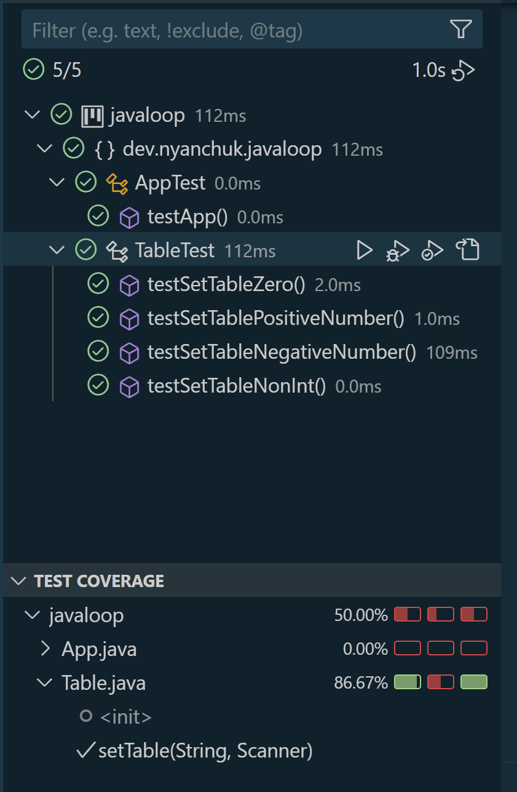

# Java Multiplication Table Console Application

This Java console application generates a multiplication table for a given integer. The application requests a number from the user and displays its multiplication table from 1 to 10. The code also includes error handling to guide users who may input non-integer values, and it’s equipped with unit tests ensuring accuracy and robustness.

## Features

- **Generate Multiplication Table**: Displays the multiplication table for a given integer from 1 to 10.
- **Input Validation**: If the user inputs a non-integer, the application displays a clear error message.
- **Comprehensive Unit Tests**: The project includes unit tests for different input cases, such as positive integers, zero, negative integers, and invalid (non-integer) input.

## Requirements

- **Java 8 or higher**
- **JUnit 5** for unit testing

## Project Setup

1. **Clone the Repository**:
    
      git clone https://github.com/NelliYanchuk/javaloop.git
      cd javaloop

2. **Running the Application**:
    - Open a terminal and run the `App` class, which serves as the entry point to the program.
    - When prompted, enter an integer to see its multiplication table from 1 to 10.

3. **Running Tests**:
    - Tests are written using JUnit 5 to validate functionality.
    - To run the tests, use the JUnit testing framework in your IDE or execute the following if using a command line:
      
          ./gradlew test  # or the equivalent command for your setup

## Usage

When the program starts, it prompts the user to input a number. Here’s an example of its usage:

    Enter a number to get its multiplication table: 5
    5 * 1 = 5
    5 * 2 = 10
    5 * 3 = 15
    5 * 4 = 20
    5 * 5 = 25
    5 * 6 = 30
    5 * 7 = 35
    5 * 8 = 40
    5 * 9 = 45
    5 * 10 = 50

If a non-integer is entered:

    Enter a number to get its multiplication table: abc
    Incorrect input. Please enter a number.

## Project Structure

- **`App` Class**: The main class that initializes user input and calls the `Table` class to generate the multiplication table.
- **`Table` Class**: Contains methods to create the multiplication table and handle input validation.
- **Tests**: The `TableTest` class includes tests for various cases, including positive numbers, zero, negative numbers, and invalid input.

## Project Diagram

Also you can find diagram here `screenshot/diagram.png`

## Testing and Code Coverage

In Visual Studio Code, navigate to the **Testing** section to run tests and observe code coverage. The project ensures a minimum of 70% coverage across all methods.

Also you can find test covering here `screenshot/test-cover-loop.png`

## Connect with me:

- [GitHub](https://github.com/NelliYanchuk)
- [LinkedIn](https://www.linkedin.com/in/nelli-yanchuk-a24b81138/)
